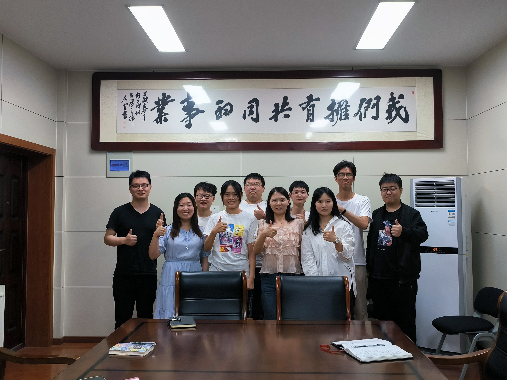

<!-- enable the latex in the markdown -->
<head>
  
  
</head>
<!-- end of the addtional script -->

Welcome to the subgroup meeting page of the team IHS which co-advising by [Prof. Ding](http://faculty.hfut.edu.cn/~uUFn2m/zh_CN/index.htm). This site will collect some documents from our subgroup meeting, usually update every Thursday.

## Upcoming Events

- 06/29/2022, Yuanbo Zhu will share his research progress.

## Scheduled Events

- 06/23/2022, Introduction about python multi-GPU training, including Dataparallel and DistributedDataparallel, by Shuizhou Ke, [attachments](assets/slides/2022-06-16-experiment-management.pdf).
- 06/16/2022, Introduction to python experiment management and visualization tools for machine learning, by Yuxuan Yang, [attachments](assets/slides/2022-06-16-experiment-management.pdf).
- 06/01/2022, Experience about obtain the data from the website, by Caiyun Zhang.
- 05/18/2022, A design science approach to the Infodemic Risk Assessment problem, by Luyue Zhao. 
- 05/11/2022, Yifan Wang and Yue Wang shared their recent researches.
- 05/04/2022, Federated Semi-supervised Medical Image Classification via Inter-client Relation Matching, by Yiyang Su, [attachments](assets/slides/2022-4-29-FSSL.pdf)
- 02/17/2022, Video retrieval in minimally invasive surgery based on semantic-preserving hashing, by Yuxuan Yang.
- 02/07/2022, We will discuss our research progress.
- 01/05/2022, Dissipative structure, by Shihui Li，[attachments](assets/slides/2022-01-05-Dissipative structure.pdf).

## Group News

- 06/22/2022, Three provincial standard proposals has been approved by the anhui provincial bureau of market supervision!
- 05/23/2022, Congratulations to our group member Caiyun Zhang on successfully defending her dissertation! 

  
IMG

  

- 10/10/2021, Welcome Yifan Wang and Yue Wang join our team!
- 10/01/2021, Congratulations to our group member Yuxuan Yang won the 3rd Prize (Team name: HFUT-MedIA) in Surgical Action Triplet Recognition 2021 Challenge! [News](https://cholectriplet2021.grand-challenge.org/), [Leadboard](https://cholectriplet2021.grand-challenge.org/results/).
